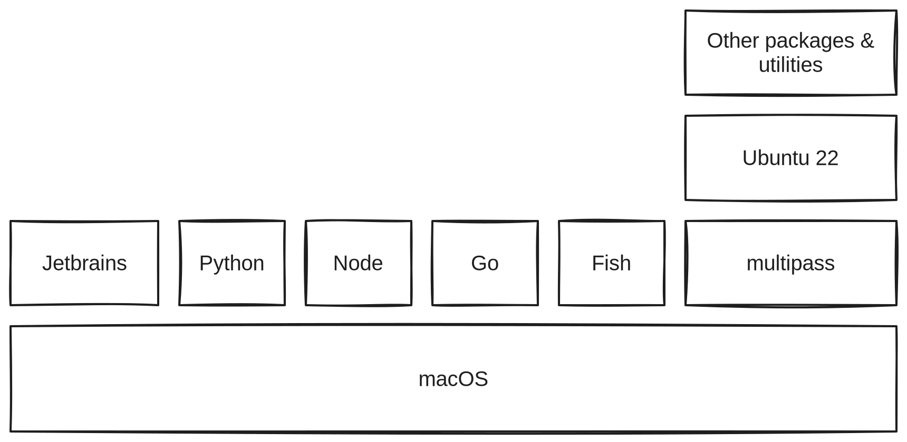

# ⚙️ Workspace Setup

Rather than using a package manager like Homebrew, I use a combination of [official installers](https://www.python.org/downloads/) and packages in VMs running via [Multipass](https://multipass.run).