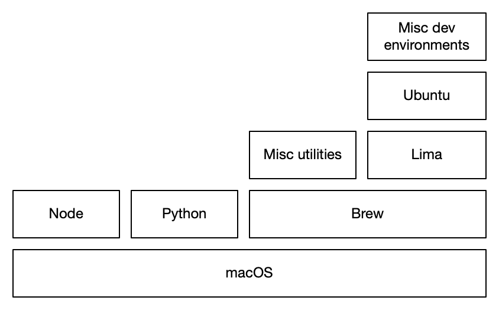

# c9r's dotfiles

- Supports the needs of a UX Architect, Software Engineer, and Project Manager
- Run `make install` to get started
- Uses GNU stow to symlink files into $HOME

See `Brewfile` for a list of apps and command-line utilities.

