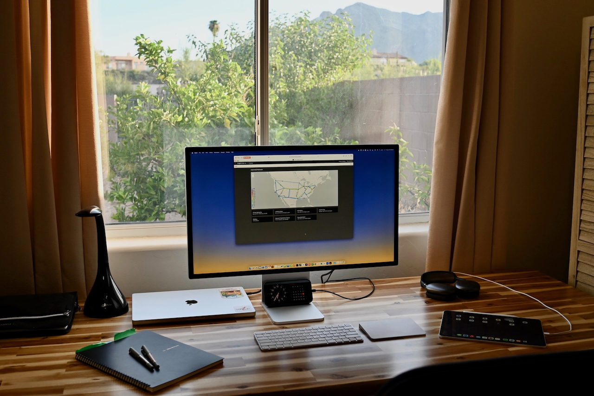

# cgreen's ~/.config

## Highlights

| Tool                            | Role             |
| ------------------------------- | ---------------- |
| [Ghostty](https://ghostty.org/) | Terminal         |
| [Homebrew](https://brew.sh)     | Package Manager  |
| [Fish](https://fishshell.com)   | Shell            |
| [Neovim](https://neovim.io)     | Text Editor      |
| [Lima](https://lima-vm.io)      | Virtual Machines |
